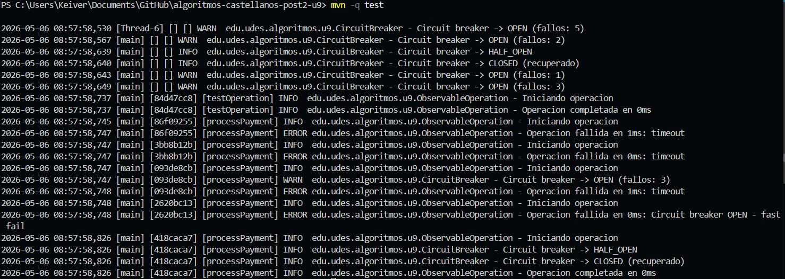

# Observabilidad y Resiliencia - Unidad 9 (Post-Contenido 2)

## Objetivo y alcance

Laboratorio de observabilidad y patrones de resiliencia. Se implementan metricas con Micrometer, logging estructurado con SLF4J + MDC y trazabilidad por requestId. Se construye un Circuit Breaker con tres estados y un Token Bucket Rate Limiter con pruebas de concurrencia.

## Arquitectura (alto nivel)

```
Cliente
	|
	v
PaymentService
	|-- TokenBucketRateLimiter (limite)
	|-- ObservableOperation (MDC + metricas)
	|-- CircuitBreaker (CLOSED/OPEN/HALF_OPEN)
	v
ExternalPaymentGateway (simulado en tests)
```

## Componentes y responsabilidad

| Componente             | Responsabilidad              | Evidencia                     |
| ---------------------- | ---------------------------- | ----------------------------- |
| MetricsRegistry        | Counters, Timer y Gauge      | MetricsRegistryTest           |
| ObservableOperation    | MDC + metricas por operacion | ObservableOperationTest       |
| CircuitBreaker         | CLOSED/OPEN/HALF_OPEN        | CircuitBreakerTest            |
| TokenBucketRateLimiter | Control de tasa por tokens   | TokenBucketRateLimiterTest    |
| PaymentService         | Integracion pipeline         | PaymentServiceIntegrationTest |

## Tecnologias y versiones

| Tecnologia      | Version |
| --------------- | ------- |
| Java            | 17      |
| Maven           | 3.9.x   |
| Micrometer Core | 1.12.0  |
| SLF4J API       | 2.0.9   |
| Logback Classic | 1.4.14  |
| JUnit 5         | 5.10.2  |

## Estructura del proyecto

```
src/
	main/
		java/edu/udes/algoritmos/u9/
			CircuitBreaker.java
			CircuitOpenException.java
			ExternalPaymentGateway.java
			MetricsRegistry.java
			ObservableOperation.java
			PaymentRequest.java
			PaymentResult.java
			PaymentService.java
			RateLimitException.java
			TokenBucketRateLimiter.java
		resources/
			logback.xml
	test/
		java/edu/udes/algoritmos/u9/
			CircuitBreakerConcurrencyTest.java
			CircuitBreakerTest.java
			MetricsRegistryTest.java
			ObservableOperationTest.java
			PaymentServiceIntegrationTest.java
			TokenBucketRateLimiterConcurrencyTest.java
			TokenBucketRateLimiterTest.java
capturas/
	output.png
pom.xml
```

## Prerrequisitos

- Java 17 o superior
- Maven 3.8+ (recomendado 3.9.x)

## Configuracion de logging

El archivo logback.xml usa MDC para requestId y operation:

```
%d [%thread] [%X{requestId}] [%X{operation}] %-5level %logger - %msg%n
```

## Ejecucion paso a paso

1. Compilar y ejecutar pruebas:

```bash
mvn -q test
```

## Pruebas ejecutadas

- MetricsRegistryTest
- ObservableOperationTest
- CircuitBreakerTest
- CircuitBreakerConcurrencyTest
- TokenBucketRateLimiterTest
- TokenBucketRateLimiterConcurrencyTest
- PaymentServiceIntegrationTest

## Comparacion teoria vs resultados (tests)

| Caso               | Teoria                                       | Observado en tests                                         |
| ------------------ | -------------------------------------------- | ---------------------------------------------------------- |
| Error rate         | $M/(N+M)$ con $M=3$, $N=2$ -> $0.6$          | 0.6 en MetricsRegistryTest                                 |
| Circuit Breaker    | 3 fallos consecutivos -> OPEN                | OPEN en CircuitBreakerTest y PaymentServiceIntegrationTest |
| HALF_OPEN a CLOSED | $successThreshold=2$ -> CLOSED tras 2 exitos | Verificado en CircuitBreakerTest                           |
| Rate Limiter       | Segunda solicitud de 100000 tokens falla     | Verificado en TokenBucketRateLimiterTest                   |
| Concurrencia CB    | 1 transicion a OPEN bajo carga               | Verificado en CircuitBreakerConcurrencyTest                |
| Concurrencia RL    | $grant \le capacity + elapsed*tokensPerMs$   | Verificado en TokenBucketRateLimiterConcurrencyTest        |

## Evidencia de ejecucion (mvn test)

Salida de la ejecucion local:



## Complejidad y rendimiento

- MetricsRegistry: $O(1)$ por operacion (contadores y timer).
- CircuitBreaker: $O(1)$ en evaluacion y transicion de estado.
- TokenBucketRateLimiter: $O(1)$ por solicitud; sincronizacion por seccion critica corta.

## Decisiones tecnicas y trade-offs

- Token Bucket con reloj del sistema por simplicidad; facilita pruebas de carga sin dependencias externas.
- Circuit Breaker con AtomicReference para cambios de estado y AtomicInteger para contadores, evitando locks pesados.
- MDC se limpia en finally para evitar fugas en pools de threads.

## Mapa de rubrica y evidencia

| Criterio                   | Evidencia concreta                                                                               |
| -------------------------- | ------------------------------------------------------------------------------------------------ |
| Implementacion             | Clases en src/main/java/edu/udes/algoritmos/u9 y pruebas en src/test/java/edu/udes/algoritmos/u9 |
| Funcionalidad y correccion | Todas las pruebas listadas en la seccion Pruebas ejecutadas                                      |
| Documentacion              | Este README + Javadoc completo en clases principales                                             |
| Estilo y convenciones      | Nombres descriptivos, validaciones explicitas y sin credenciales hardcodeadas                    |
| Entregables                | Proyecto Maven estandar + capturas en carpeta capturas                                           |

## Solucion de problemas frecuentes

- Si no aparecen requestId/operation en logs, verificar logback.xml en src/main/resources.
- Si el Circuit Breaker no pasa a HALF_OPEN, revisar resetTimeoutMs y que exista una nueva llamada luego del timeout.
- Si el Rate Limiter parece permitir de mas, confirmar el tiempo transcurrido (refill por ms).

## Benchmarks JMH (si la rubrica lo exige)

La guia no incluye benchmarks JMH. Si el evaluador los exige, se agrega un modulo de benchmarks y se incorpora la salida real en esta seccion.
