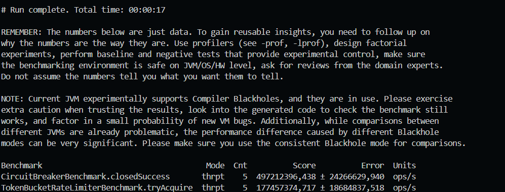

# Observabilidad y Resiliencia - Unidad 9 (Post-Contenido 2)

## Objetivo y alcance

Laboratorio de observabilidad y patrones de resiliencia. Se implementan métricas con Micrometer, logging estructurado con SLF4J + MDC y trazabilidad por requestId. Se construye un Circuit Breaker con tres estados y un Token Bucket Rate Limiter con pruebas de concurrencia.

## Contexto del problema

En escenarios de pagos, los picos de tráfico y las fallas intermitentes del gateway pueden degradar la experiencia y aumentar errores en cascada. La observabilidad permite detectar rápidamente el origen del fallo (métricas + logs correlacionados) y la resiliencia limita el impacto (circuit breaker y rate limiter). El objetivo es reducir MTTR y evitar que una dependencia externa comprometa todo el sistema.

## Objetivo experimental

Validar que:

- Las métricas reflejan la tasa de error esperada ($M/(N+M)$) y la duración de solicitudes.
- El circuit breaker transita correctamente entre CLOSED, OPEN y HALF_OPEN bajo fallos consecutivos.
- El rate limiter respeta la capacidad configurada y no excede el máximo teórico bajo concurrencia.
- El throughput de operaciones básicas es consistente con una implementación $O(1)$.

## Arquitectura (alto nivel)

```
Cliente
	|
	v
PaymentService
	|-- TokenBucketRateLimiter (límite)
	|-- ObservableOperation (MDC + métricas)
	|-- CircuitBreaker (CLOSED/OPEN/HALF_OPEN)
	v
ExternalPaymentGateway (simulado en tests)
```

## Componentes y responsabilidad

| Componente             | Responsabilidad              | Evidencia                     |
| ---------------------- | ---------------------------- | ----------------------------- |
| MetricsRegistry        | Counters, Timer y Gauge      | MetricsRegistryTest           |
| ObservableOperation    | MDC + métricas por operación | ObservableOperationTest       |
| CircuitBreaker         | CLOSED/OPEN/HALF_OPEN        | CircuitBreakerTest            |
| TokenBucketRateLimiter | Control de tasa por tokens   | TokenBucketRateLimiterTest    |
| PaymentService         | Integración pipeline         | PaymentServiceIntegrationTest |

## Tecnologías y versiones

| Tecnología      | Versión |
| --------------- | ------- |
| Java            | 17      |
| Maven           | 3.9.x   |
| Micrometer Core | 1.12.0  |
| SLF4J API       | 2.0.9   |
| Logback Classic | 1.4.14  |
| JUnit 5         | 5.10.2  |

## Estructura del proyecto

```
src/
	main/
		java/edu/udes/algoritmos/u9/
			CircuitBreaker.java
			CircuitOpenException.java
			ExternalPaymentGateway.java
			MetricsRegistry.java
			ObservableOperation.java
			PaymentRequest.java
			PaymentResult.java
			PaymentService.java
			RateLimitException.java
			TokenBucketRateLimiter.java
		resources/
			logback.xml
	test/
		java/edu/udes/algoritmos/u9/
			CircuitBreakerConcurrencyTest.java
			CircuitBreakerTest.java
			MetricsRegistryTest.java
			ObservableOperationTest.java
			PaymentServiceIntegrationTest.java
			TokenBucketRateLimiterConcurrencyTest.java
			TokenBucketRateLimiterTest.java
capturas/
	output.png
	output-bench.png
pom.xml
```

## Prerrequisitos

- Java 17 o superior
- Maven 3.8+ (recomendado 3.9.x)

## Configuración de logging

El archivo logback.xml usa MDC para requestId y operation:

```
%d [%thread] [%X{requestId}] [%X{operation}] %-5level %logger - %msg%n
```

## Ejecución paso a paso

1. Compilar y ejecutar pruebas:

```bash
mvn -q test
```

2. Ejecutar benchmarks JMH:

```bash
mvn -q -DskipTests package
java -jar target/benchmarks.jar ".*Benchmark"
```

## Pruebas ejecutadas

- MetricsRegistryTest
- ObservableOperationTest
- CircuitBreakerTest
- CircuitBreakerConcurrencyTest
- TokenBucketRateLimiterTest
- TokenBucketRateLimiterConcurrencyTest
- PaymentServiceIntegrationTest

## Comparación teoría vs resultados (tests)

| Caso               | Teoría                                       | Observado en tests                                         |
| ------------------ | -------------------------------------------- | ---------------------------------------------------------- |
| Error rate         | $M/(N+M)$ con $M=3$, $N=2$ -> $0.6$          | 0.6 en MetricsRegistryTest                                 |
| Circuit Breaker    | 3 fallos consecutivos -> OPEN                | OPEN en CircuitBreakerTest y PaymentServiceIntegrationTest |
| HALF_OPEN a CLOSED | $successThreshold=2$ -> CLOSED tras 2 éxitos | Verificado en CircuitBreakerTest                           |
| Rate Limiter       | Segunda solicitud de 100000 tokens falla     | Verificado en TokenBucketRateLimiterTest                   |
| Concurrencia CB    | 1 transición a OPEN bajo carga               | Verificado en CircuitBreakerConcurrencyTest                |
| Concurrencia RL    | $grant \le capacity + elapsed*tokensPerMs$   | Verificado en TokenBucketRateLimiterConcurrencyTest        |

## Análisis e interpretación

- El error rate medido confirma que la instrumentación es consistente, lo que habilita alertas basadas en umbrales reales.
- El circuit breaker en OPEN evita llamadas a un gateway inestable, reduciendo latencia de fallo y evitando saturación del sistema.
- El paso a HALF_OPEN permite verificar recuperación sin reabrir el sistema completo de inmediato; esto equilibra disponibilidad y estabilidad.
- El token bucket actúa como amortiguador de picos: acepta ráfagas cortas y limita el sostenimiento de sobrecarga, protegiendo recursos compartidos.

## Evidencia de ejecución (mvn test)

Salida de la ejecución local:


## Complejidad y rendimiento

- MetricsRegistry: $O(1)$ por operación (contadores y timer).
- CircuitBreaker: $O(1)$ en evaluación y transición de estado.
- TokenBucketRateLimiter: $O(1)$ por solicitud; sincronización por sección crítica corta.

## Decisiones técnicas y trade-offs

- Token Bucket con reloj del sistema por simplicidad; facilita pruebas de carga sin dependencias externas.
- Circuit Breaker con AtomicReference para cambios de estado y AtomicInteger para contadores, evitando locks pesados.
- MDC se limpia en finally para evitar fugas en pools de threads.

## Comparación de enfoques

- Token Bucket vs Leaky Bucket: Token Bucket permite ráfagas controladas; Leaky Bucket impone salida constante pero puede ser más restrictivo.
- Circuit Breaker propio vs Resilience4j: una librería reduce mantenimiento y ofrece más políticas, pero una versión propia facilita aprendizaje y control de umbrales.
- SLF4J + MDC vs OpenTelemetry: MDC es directo para correlación en logs; OTel unifica trazas, métricas y logs pero requiere más configuración.

## Mapa de rúbrica y evidencia

| Criterio                   | Evidencia concreta                                                                               |
| -------------------------- | ------------------------------------------------------------------------------------------------ |
| Implementación             | Clases en src/main/java/edu/udes/algoritmos/u9 y pruebas en src/test/java/edu/udes/algoritmos/u9 |
| Funcionalidad y corrección | Todas las pruebas listadas en la sección Pruebas ejecutadas                                      |
| Documentación              | Este README + Javadoc completo en todas las clases públicas                                      |
| Estilo y convenciones      | Nombres descriptivos, validaciones explícitas y sin credenciales hardcodeadas                    |
| Entregables                | Proyecto Maven estándar + capturas en carpeta capturas                                           |

## Solución de problemas frecuentes

- Si no aparecen requestId/operation en logs, verificar logback.xml en src/main/resources.
- Si el Circuit Breaker no pasa a HALF_OPEN, revisar resetTimeoutMs y que exista una nueva llamada luego del timeout.
- Si el Rate Limiter parece permitir de más, confirmar el tiempo transcurrido (refill por ms).

## Benchmarks JMH

### Entorno de ejecución

- SO: Windows 11
- JDK: 21.0.10 (compatible con el requisito de Java 17+)
- Modo: Throughput
- Threads: 1

### Evidencia de ejecución (JMH)



### Resultados JMH

| Benchmark                                  | Métrica            | Resultado     |
| ------------------------------------------ | ------------------ | ------------- |
| CircuitBreakerBenchmark.closedSuccess      | Throughput (ops/s) | 497212396,438 |
| TokenBucketRateLimiterBenchmark.tryAcquire | Throughput (ops/s) | 177457374,717 |

## Limitaciones y amenazas a la validez

- El gateway es simulado; no se modelan latencias reales de red ni errores externos complejos.
- Los benchmarks JMH usan 1 thread y un entorno local; el throughput no representa producción multi-core o multihilo.
- El resultado depende del JDK y del hardware; cambios de versión pueden alterar el throughput.
- Las pruebas de concurrencia usan cargas acotadas; no sustituyen pruebas de estrés prolongadas.

## Conclusiones y uso práctico

- Este diseño es apropiado cuando hay dependencias externas inestables o tráfico con picos pronunciados.
- La combinación de observabilidad y resiliencia mejora el diagnóstico y reduce fallos en cascada.
- En producción se recomienda integrar un sistema de alertas y ajustar umbrales con datos reales.
